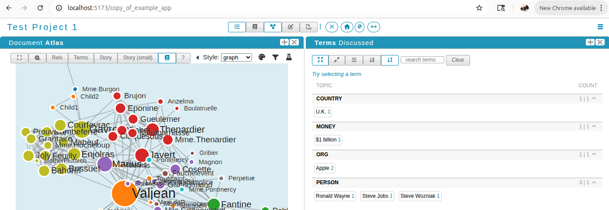
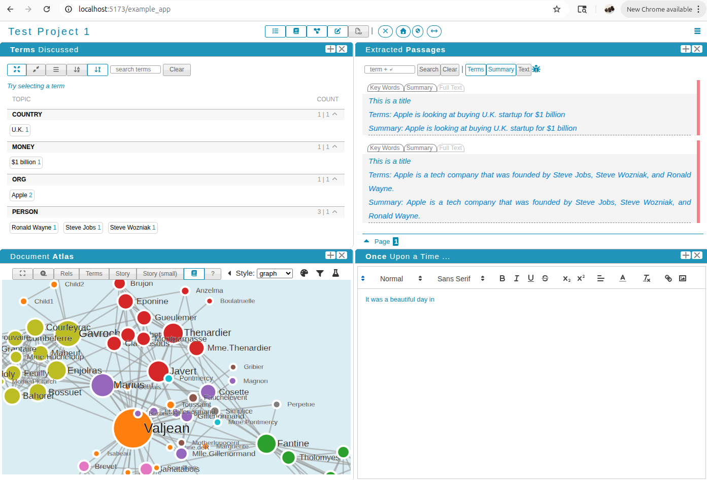
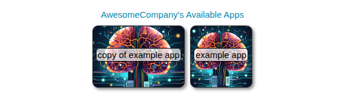
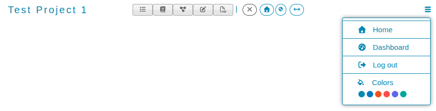
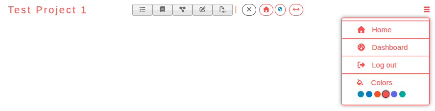

# VueVerse: a modular frontend framework built on Vue.JS v3.

A fully reactive frontend application universe that is backend agnostic, but which allows for many apps to be built dynamically and side by side. Created with Vue 3 and Vite. I have found this frontend to be robust yet easy to set up, and so, after trying out many ftonends, it this framework has become my go-to starting point .

## Features
- **Rapid prototyping** and deployment of experimental apps, but supported by a stable framework.
- **Auto-detection** of newly added projects (see `Modifying/creating a new sub-project directory` below). This allows for rapid prototyping of new applications, especially if they use similar data and backend APIs.
- **Auto-gallery.** An index page that automatically lists all (sub)projects as tiles, linked with URLs to each subproject.


## Example
Each app is able to use a variety of reactive window elements (e.g., windows shown as toggle buttons in the top), available in `src/views/example_app`, which makes for an ecosystem of app sub-windows that can be tiled using `css-grid`. 

Here is an example of two windows that are tiled side-by-side within `example_app`:


Here is another example of the same app, but with four windows turned on using the menu bar above. All of the window configurations can be actively modified by the user.



### Modifying/creating a new app from a sub-project directory
Copying and pasting a legitimate app directory (containing a legitimate `main.vue`; see Anatomy), along with changing the directory's name, should create a new app with that name. When done, it should show up in the index/gallery page as another app. E.g, recursively copying `src/views/example_app` to `src/views/copy_of_example_app` should magically populate the new app named `copy_of_example_app`:



## Starting out

- **Install.** On Ubuntu, follow instructions to install [NVM](https://github.com/nvm-sh/nvm):
   ```sh
   # Install node version manager (nvm)
   curl -o- https://raw.githubusercontent.com/nvm-sh/nvm/v0.40.2/install.sh | bash
   # This ensures that nvm will be found
   source ~/.bashrc
   # Install the latest node package manager (NPM) using NVM
   nvm install --latest-npm
   # cd to this project directory and enter:
   npm install
   ```
- **Running.**
    ```sh
    # Loading the stable NPM from NVM
    npm use stable
    # Compile and Hot-Reload for Development
    npm run dev
    # Compile and Minify for Production
    npm run build
    ```


# Installation

## Prerequisites
- The main prerequisite is: a reasonable understanding of how vue.js projects work on NPM. 

## The anatomy of a mini-app in this universe
Each project subdirectory within `src/views/` will be considered to be a standalone vue app if and only if they contain a `main.vue` file within. 

Each project E.g. project `XYZ` that sits at `/src/views/XYZ/` (and which must contain a `main.vue` file in its root) will be automatically exposed at URL: `<base_url>/XYZ` (e.g. `http://localhost:5173/XYZ`). Each project directory will be displayed as a tile on the main (gallery) page. The tile will, by default, display the project name **unless** an icon.jpg/png/svg file is availble within the project subdirectory (e.g. `/src/views/XYZ/icon.jpg`), in which case the icon will be also be shown as the tile's background.

*Under the hood data management.* The project name, exposed path, and, if available, background image (icon) are all captured by the `src/stores/global.js` script, which initiates a pinia store after parsing for project files. `global.js` is then loaded and used by `src/main.js` to initiate the (sub) component (`XYZ`) and establish appropriate routes (`localhost:5173/XYZ`). The tiles index page are created with `src/views/HomeView.vue`, which loads `global.js` and iteratively creates tiles and links appropriately.

# Customizing an app

## Website-wide changes (applies to and is accessible to all mini-apps)
- Modify commonly used variables such as `companyName` in `common.json`. These variables will be avilable within each mini-app via `this.global.$commonvariables` (e.g., in this case, `this.global.$commonvariables.companyName`)
- Obvirously, you can modify the `favicon.ico` to suit your website's theme.
- The landing page simple for the purpose of customizing to your own website. Just make sure that the `<div>` with id `app` is avilable, otherwise the list of apps wont be rendered.

## Customizing a mini-app

Within each app, say `example_app` kept at `src/views/example_app/`, there should be a file called `local.js` in the stores sub-directory (`src/views/example_app/stores/local.js`). The variables wihin the `state` key (e.g., `$msg`, `$projectName`, `$linkTuples`) can be reused across the mini-app via the `local` namespace. E.g., `$projectName` can be btained within vue as `local.$projectName`. $linkTuples are used to populate a reusable hamburger dropdown menu.  E.g.: 



This example is built to be reused (at least for my purposes) and higly reactive. E.g., changing the color using the drop down menu initiates a recoloring of the stylesheets, resulting in a seamless change in color of the entire app:



Finally, within the `main.vue` file, when adding new windows/templates to the vue app (e.g., `./pieces/exploreTerms.vue` below), be sure to add a new key to the `localPanels`, with keys `name` (how ), `title`, `id` (how vue accesses this template), `buttonContent`, ()

```js
var localPanels = {};

// These are our main panels... loaded LOCALLY
import termsContent from './pieces/exploreTerms.vue'
// NOT UPDATING THE LOCALPANELS DICTIONARY WILL RESULT IN THESE COMPONENTS 
// NOT BEING LOADED
localPanels['Terms'] = {
  name: 'Terms', // Used as a short name in menu buttons, especially if the buttons are exapanded (vs collapsed).
  buttonContent: '<i class="fas fa-list"></i>', // This is the collapsed version of button (currently using fontawesome)
  title: '<strong>Terms</strong> Discussed',    // This will be the title of the template/window
  id: 'panelTerms',                             // This is how Vue will access the template
  active: true,    // if true, then the window will be displayed when loaded, if multiple templates are active, then they will be tiled
  order: 4,        // when tiled, the order in which this window should be placed
}
```

For the css-grid savvy, there is also a `localGridDirectives` that dictates how windows start to populate

```js
var localGridDirectives = {
  0: { display: 'grid', 'grid-template-columns': '1fr', 'grid-template-rows': '1fr' },
  1: { display: 'grid', 'grid-template-columns': '1fr', 'grid-template-rows': 'auto' },
  2: { display: 'grid', 'grid-template-columns': '1fr 1fr', 'grid-template-rows': '1fr' },
  4: { display: 'grid', 'grid-template-columns': '1fr 1fr', 'grid-template-rows': 'auto' },
  3: { display: 'grid', 'grid-template-columns': '1fr 1fr', 'grid-template-rows': '1fr 1fr' },
  other: {
    display: 'grid',
    'grid-template-columns': '1fr 1fr 1fr',
    'grid-template-rows': '1fr 1fr',
  },
}
```


### Styling
If a `main.vue` (or its ) file references a style/class, it will either be defined at the bottom of that file or within the scss file `src/assets/css/main.scss`. This file lists the variables (e.g., the appearance of each sub-window's title bar can be modified within the `__header` subsection of the `.card` entry in `main.scss`)

### Fonts available

Aside from the normal HTML fonts, one can use both [Font Awesome 7](https://fontawesome.com/v7/search?q=arrow&o=r&m=free) and [Foundation Icons 3](https://zurb.com/playground/foundation-icon-fonts-3) directly in HTML.


# Recommended IDE Setup

[VSCode](https://code.visualstudio.com/) + [Volar](https://marketplace.visualstudio.com/items?itemName=Vue.volar) (and disable Vetur) + [TypeScript Vue Plugin (Volar)](https://marketplace.visualstudio.com/items?itemName=Vue.vscode-typescript-vue-plugin).

# TODO

- Remove unused style elements in `src/assets/css/main.scss` (it is currently bloated, and therefore could be confusing to a newcomer).
- 